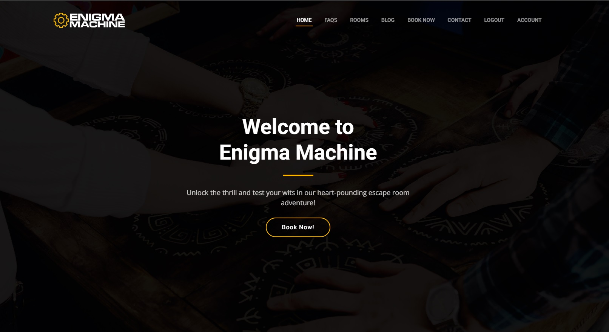
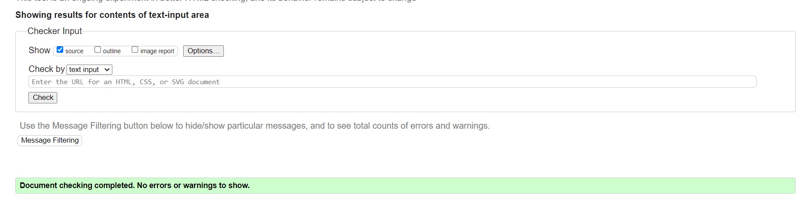
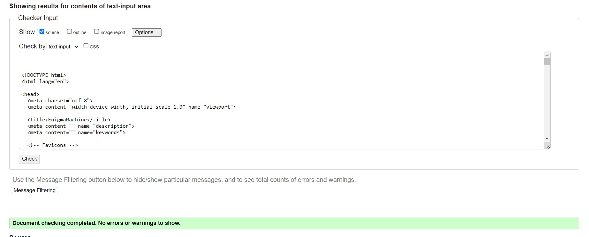
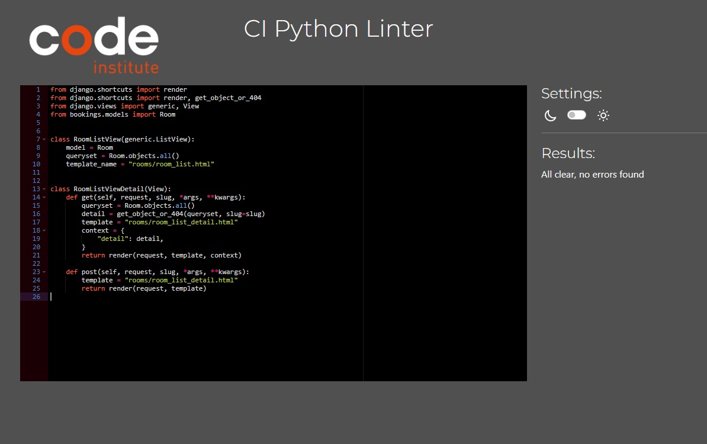
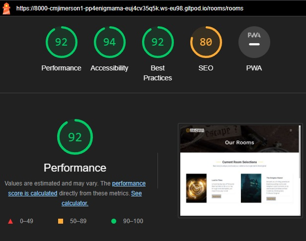
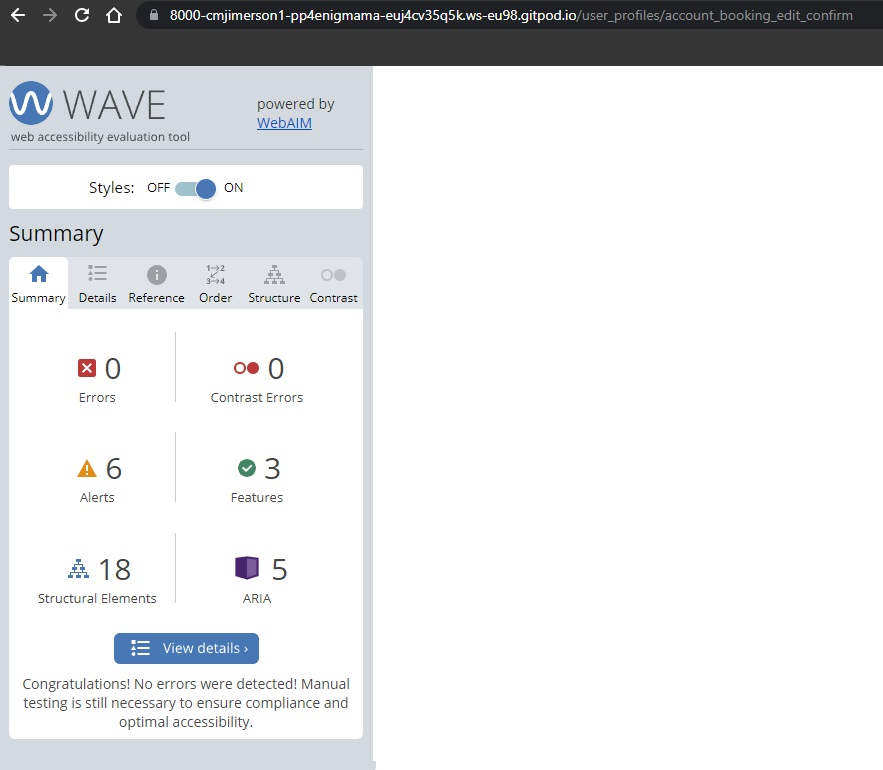
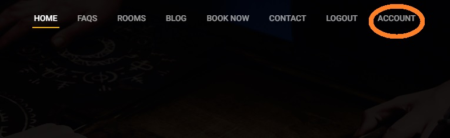
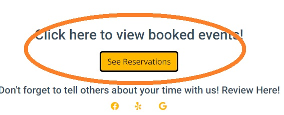
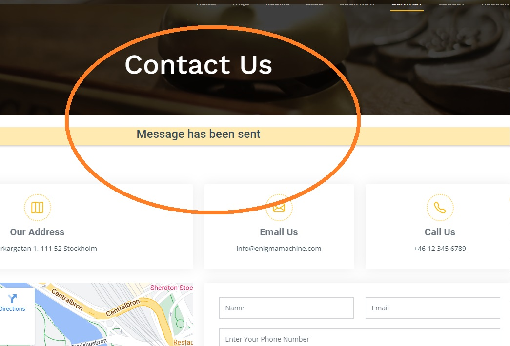
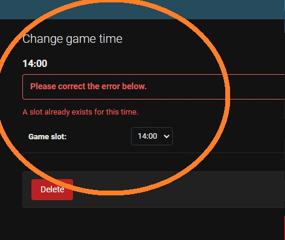

# Enigma Machine

**Developer: Christopher Jimerson**

💻 [Visit live website](https://pp4-enigma-machine.herokuapp.com/)

## Table of Contents
  - [About](#about)
  - [User Goals](#user-goals)
  - [Site Owner Goals](#site-owner-goals)
  - [User Experience](#user-experience)
  - [User Stories](#user-stories)
  - [Design](#design)
    - [Colours](#colours)
    - [Fonts](#fonts)
    - [Structure](#structure)
      - [Website pages](#website-pages)
      - [Database](#database)
    - [Wireframes](#wireframes)
  - [Technologies Used](#technologies-used)
  - [Features](#features)
  - [Validation](#validation)
  - [Testing](#testing)
    - [Manual testing](#manual-testing)
    - [Automated testing](#automated-testing)
    - [Tests on various devices](#tests-on-various-devices)
    - [Browser compatibility](#browser-compatibility)
  - [Bugs](#bugs)
  - [Heroku Deployment](#heroku-deployment)
  - [Credits](#credits)
  - [Acknowledgements](#acknowledgements)

### About

Enigma Machine is a fictitious business where users can learn about escape rooms, view the current room offerings, create and manage an account, and make bookings for escape room events. 

### User Goals

- Create bookings for escape room games.
- Educate themselves on what an escape room is.
- View the current rooms that the company has available for booking.
- View promotions or sales currently going on.
- Easily communicate with business.

### Site Owner Goals

- Allow users to create accounts and make reservations.
- Be able to track booking data in an easy way.
- Provide responsive and quality applications to drive sales and user engagement.
- Make it as simple and clear as possible for users to book.
- Track communication through the website 
- Advertise news, promotions, or sales in a clear and easy way.

## User Experience

### Target Audience

- Corporate clients who are looking for team building events
- Escape Room enthusiasts
- Families looking for events for their families, of all ages. 
- Tourists looking for things to do in the city.
- Friends looking for unique experiences for their next bachelor or bachelorette party. 
- Teachers or schools looking for age appropriate activities.

### User Requirements and Expectations

- Easy to use and navigable site.
- Responsive design.
- Easy to understand and labeled information channels.
- Accessable.
- Account management with booking history.
- Edit/Cancel bookings.
- Easily and clear communication channels.

##### Back to [top](#table-of-contents)

## User Stories

### Users

1. As a user, I want to be able to view the availability and schedule of each escape room game in real-time on the booking website, so that I can select a time slot that works best for me.
2. As a user, I want to be able to view all available escape room games on the booking website, including their descriptions, difficulty levels, and any other information so that I can make an informed decision on which game to reserve.
3. As a user, I want to be able to reserve multiple escape room games for different time slots in a single booking transaction, so that I can plan a day of fun-filled activities with my friends or family.
4. As a user, I want to be able to create an account on the booking website to store my booking history so that I can easily track my previous experiences to ensure no booking errors in the future.
5. As a user, I want to be able to easily cancel or reschedule my escape room game reservations through the booking website, so that I can adjust my plans quickly if needed.
6. As a user, I want to be able to leave reviews and ratings for escape room games that I have played, so that I can share my feedback and experiences with other users, and help them make informed decisions when booking games.
7. As a user, I want to be able to view special promotions, discounts, or packages for escape room games on the booking website, so that I can take advantage of any available deals and save on my bookings.
8. As a user, I want to be able to access the booking website on different devices, including desktops, laptops, tablets, and smartphones, with a responsive and user-friendly design, so that I can make bookings anytime and anywhere.
9. As a user, I want to be able to view detailed information about the escape room game venues, such as their locations, facilities, parking options, and accessibility, so that I can plan my visit accordingly and have a smooth experience.
10. As a user, I want to be able to contact the escape room game venue or customer support through the booking website, with options for email, or phone support, so that I can get assistance or information whenever I need it.
11. As a user, I want to be able to view photos of the escape room game themes and rooms on the booking website, so that I can get a sneak peek of the games and get excited about the experience.
12. As a user, I want to be able to customize my escape room game experience by requesting special arrangements for birthdays, team-building events, or other occasions, through my booking so that I can get more out of my event planning.
13. As a user I want to be able to delete my own account and request all my data be removed from your servers/databases so that I can exercise my data protection rights.
14. As a user I want to be able to edit my account details so that I can keep the booking process smooth and easy even if my email or other data changes.
15. As a user I want to be able to create a reservation using my account information, and having all the applicable data visible such as group sizes, date, time, etc so that I can quick and easily secure a booking.

### Admin / Site Owner

16. As an admin user, I want to be able to view a list of all upcoming escape room events booked by customers, including their details such as date, time, game theme, and customer information, so that I can have an overview of the bookings and manage them efficiently.
17. As an admin user, I want to be able to add, edit, or cancel escape room bookings on behalf of customers, including updating the date, time, or game theme, so that I can accommodate their requests or resolve any issues.
18. As an admin user, I want to be able to *manage customer accounts and profiles, including creating, updating, or deleting customer information, and viewing their booking history, so that I can provide personalized and efficient customer service.
19. As an admin user, I want to be able to manage special promotions, discounts, or packages for escape room games, including creating, updating, or expiring promotions so that I can attract more customers and boost sales.
20. As an admin user I want to be able to add new games to the website as the company builds and expands so that we can have the newest and most up to date information about our games immediately visible to our customer.
21. As an admin user I want to be able to add or remove time slots available for booking so that we can adjust our business hours to match the flow of the business traffic to our location.

### Kanban, Epics & User Stories
- GitHub Kanban was used to track all open User Stories. 
- Epics were created throuhg the Milestone functionality.

Epics

Kanban

##### Back to [top](#table-of-contents)

## Design

### Colours
 The decision to use black, white, and yellow as the color palette for the site is to create a visually striking and immersive user experience. The combination of these colors can evoke a sense of mystery, excitement, and adventure, aligning with the theme of escape rooms. 
 Segments of the website are either dark, or have a shadowy filter over images. The darker color represents the intrigue and suspense associated with escape rooms, creating an atmosphere of anticipation. 
 Contrasting against the black background, key elements such as text, buttons, and icons are presented in a clean, crisp white color. The white color enhances readability and provides a sense of clarity, ensuring that important information and calls to action stand out prominently. 
 To inject energy and highlight important elements, vibrant yellow accents are strategically incorporated throughout the website. The yellow color represents excitement, challenge, and adventure, aligning with the thrill of solving puzzles and escaping from the rooms. Yellow is used sparingly but effectively to draw attention to specific areas, such as buttons, links, or important messages. 
 Overall, the black, white, and yellow color palette for the escape room website aims to create a visually captivating and immersive experience for users. It combines the intrigue of black, the clarity of white, and the excitement of yellow to align with the adventurous and thrilling nature of escape rooms, enticing visitors to explore the website and book their escape room experience. 

### Fonts
 The selected fonts are from Google Fonts are are Open Sans, Roboto, and Work Sans of varying weights and syles. 

### Structure

#### Website pages

The site was designed for the user to be familiar with the layout such as a navigation bar along the top of the pages and a hamburger menu button for smaller screen.

The footer is shared across all pages and has links social media, and to important pages, as well as information on Privay Policy and Terms of Service.

- The site consists of the following pages:
    - Home:
    - FAQ:
    - Rooms:
      - Room Detail:
    - Blog:
      - Blog Detail
    - Book Now:
      - Cart View
      - Booking Form
      - Booking Confirmation
    - Contact:
    - Sign Up:
    - Login/Logout:
    - Account:
      - Account Edit
      - Account Booking List
      - Account Booking Edit
    - Admin 

#### Database

- Built with Python and the Django framework with an ElephantSQL database for the final deployed version.

Show diagram

####  Reservation
The Reservation Model contains the following:
 - id
 - customer_name
 - customer_email
 - player_number
 - price
 - date
 - time_slot
 - room_choice
 - comment
 - user_id

#### Room
The Room Model contains the following:
 - id
 - room_name
 - slug
 - short_room_description 
 - room_description
 - small_image
 - detail_image

#### GameTime
The GameTime Model contains the following:
  - id
  - game_slot 

 With choices:
  - 00:00	
  - 02:00	
  - 04:00	
  - 06:00	
  - 08:00	
  - 10:00	
  - 12:00	
  - 14:00	
  - 16:00	
  - 18:00	
  - 20:00	
  - 22:00	

#### Blog
The Blog Model contains the following:
 - id
 - blog_title
 - slug
 - tags
 - blog_image
 - blog_small_image
 - blog_blurb
 - blog_content
 - posted_date
 - meta_tags

 With Choices: 
  - Blog	
  - Promotion	
  - Sale	
  - News	
  - Partner Advert	
  - Holiday	
  - B.T.S	
  - Meet the Staff	

#### Contact
The Contact Model contains the following:
 - inquiry_id
 - inquiry_name
 - inquiry_email
 - phone_number
 - created_date
 - inquiry_message

#### FAQ
The FAQ Model contains the following:
 - id
 - question 
 - answer

### Wireframes
The wireframes were created using Balsamiq

## Technologies Used

### Languages & Frameworks

- HTML
- CSS
- Javascript
- Python
- Django

### Libraries & Tools

- [Am I Responsive](http://ami.responsivedesign.is/)
- [Balsamiq](https://balsamiq.com/)
- [Bootstrap v5.2](https://getbootstrap.com/)
- [Cloudinary](https://cloudinary.com/)
- [Favicon.io](https://favicon.io)
- [Chrome dev tools](https://developers.google.com/web/tools/chrome-devtools/)
- [Font Awesome](https://fontawesome.com/)
- [Git](https://git-scm.com/)
- [GitHub](https://github.com/)
- [Google Fonts](https://fonts.google.com/)
- [Heroku Platform](https://id.heroku.com/login)
- [jQuery](https://jquery.com)
- [Postgres](https://www.postgresql.org/)
- [ElephantSQL](https://www.elephantsql.com/)
- Validation:
  - [WC3 Validator](https://validator.w3.org/)
  - [Jigsaw W3 Validator](https://jigsaw.w3.org/css-validator/)
  - [JShint](https://jshint.com/)
  - [CI Validator(PEP8)](https://pep8ci.herokuapp.com//)
  - [Lighthouse](https://developers.google.com/web/tools/lighthouse/)
  - [Wave Validator](https://wave.webaim.org/)

##### Back to [top](#table-of-contents)

## Features

### Home
- Home page consists of a nav bar, hero section, about section, statistic, and team section, as well as footer. 

Feature

#### Logo and Navigation
- Responsive custom logo
- Responsive nav bar, transforming ot 'hamburger' menu
- Respondes to user authentication, displaying Register/Log In for unauthenticated, or Log Out/Account for authenticated
- Displays all the route pages

Feature

#### Footer
- Responsive coverage along the bottom of the page
- Displays across all pages
- Social media and other userful links displayed

Feature

### FAQ
- FAQ page displays a series of questions that are common and specific to the user, as well as the ansers to the questions. 

Feature

### Room
- Room page displays a collection of cards with hook images and a brief description and link to further room information.

Feature

### Blog
- Blog page displays a collection of posts, each with a hook image, tags, and a small blurb to entice the reader to it's content. 

Feature

### Book Now
- Book Now is only visible to authenticated users.
- It displays the games available for booking, by default it displays the earliest bookable games which are at least one day in the future
- If the user has visited other pages while selecteing they can click the View Cart button to be taken to the cart view where their cart is stored. 

Feature

#### Book Now-Cart View
- Once a booking is selected it shows as Selected, and is displayed in the cart below.
- Users can choose as many bookings as needed.

Feature

#### Book Now-Booking Form
- The booking form will ask for the number of players in each room the user has chosen.
- It displays the total price and then the users saved account data (name, and email) will populate the form
- The comment section is optional

Feature

#### Book Now-Confirmation
- If successful you will be met with a confirmation page with links directing to either Account or Contact.

Feature

### Contact
- Contact page displays the company information
- There is a contact form that any user, even unauthenticated, can use to reach out to the company throgh the website. 
- Successful form will display to user

Feature

### Sign Up/Login/Logout
- These pages are from AllAuth, a django library, but have been styled to fit the site
- Users can sign up by filling out a simple form
- Loging in or out will redirect to home

Feature

### Account
- The Account page allows users to see thier user information.

Feature

#### Account Edit
- From the Account page users can elect to update their account information
- Successfuly updating will result in a success message.
- Users can also choose to delete their whole account, which will also delete their bookings

Feature

#### Account Booking View
- Users can view their booking history, past and future

Feature

#### Account Booking Edit/Delete
- Users can edit or delete bookings that are only further than 24 hours out
- Users can select a new booking date that is more than 24 hours out

Feature

#### Account Booking Edit Confirmation
- Users are presented with a confirmation page to ensure accuracy of their selection

Feature

#### Django Admin 
- Djano comes with built in admin site functionality 

Feature

##### Back to [top](#table-of-contents)

## Validation

The W3C Markup Validation Service

Home

FAQ

Room

Room(Detail View)

Blog

Blog(Detail View)

Book Now

Reservation Choice

Reservation Booking Form

Reservation Confirmation

Contact

Sign Up

Logout

Login

Account

Account Info Edit

Account Booking List

Account Booking Edit

Account Booking Edit Confirm

403

404

500

### CSS Validation
The W3C Jigsaw CSS Validation Service

CSS

### JavaScript Validation
JSHint JS Validation Service

I had issues with getting certain Javascript to work in Django, but I validated all my code even on page scripts.

Account Page Edit

main.js

Book Now-Booking Form

This Javascript doesn't pass validation but that is due to the use of Django template variable in the code

Book Now-Cart View

Account-Booking Edit

### PEP8 Validation

##### Blog App

Files

views.py

urls.py

tests.py

models.py

admin.py

##### Booking App

Files

  

views.py

  
  

  

urls.py

  
  

  

forms.py

  
  

  

models.py

  
  

  

admin.py

  
  

  

res_tags.py

  
  

##### Contact App

Files

  

views.py

  
  

  

urls.py

  
  

  

tests.py

  
  

  

forms.py

  
  

  

models.py

  
  

  

admin.py

  
  

##### FAQ App

Files

  

views.py

  
  

  

urls.py

  
  

  

tests.py

  
  

  

models.py

  
  

  

admin.py

  
  

##### Rooms App

Files

  

views.py

  
  

  

urls.py

  
  

    

tests.py

  
  

##### User Profile App

Files

  

views.py

  
  

  

urls.py

  
  

  

tests.py

  
  

### Lighthouse

Performance, best practices and SEO was tested using Lighthouse.

#### Desktop

Home

FAQ

Rooms

Rooms Detail

Blog

Blog Detail

Book Now

Contact

PAGE

 

### Wave
WAVE was used to test the websites accessibility.

Home

FAQ

Room

Room(Detail View)

Blog

Blog(Detail View)

Book Now

Reservation Choice

Reservation Booking Form

Reservation Confirmation

Contact

Sign Up

Logout

Login

Account

Account Info Edit

Account Booking List

Account Booking Edit

Account Booking Edit Confirm

##### Back to [top](#table-of-contents)

 

## Testing

1. Manual testing
2. Automated testing

### Manual testing

1. As a user, I want to be able to view the availability and schedule of each escape room game in real-time on the booking website, so that I can select a time slot that works best for me.

**Feature** | **Action** | **Expected Result** | **Actual Result**
------------ |------------ | ------------ | ------------ |
 | Book Now | Navigate to the Book Now page | The availability and schedule information is displayed. | Works as Expected|

Screenshot

2. As a user, I want to be able to view all available escape room games on the booking website, including their descriptions, difficulty levels, and any other information so that I can make an informed decision on which game to reserve.

**Feature** | **Action** | **Expected Result** | **Actual Result**
------------ |------------ | ------------ | ------------ |
 | Room | Navigate to the Room page | The descriptions and details provide sufficient information to make an informed decision. | Works as Expected |

Screenshot

3. As a user, I want to be able to reserve multiple escape room games for different time slots in a single booking transaction, so that I can plan a day of fun-filled activities with my friends or family.

**Feature**| **Action** | **Expected Result** | **Actual Result**
------------ |------------ | ------------ | ------------ |
 | Book Now | Navigate to the Booking page | Click to select games and add them to cart | Works as Expected |
 | Book Now-Booking Form | Navigate to the Booking page form| The booking summary shows the selected escape room games and their respective time slots. | Works as Expected |
 | Book Now-Confirmation | Complete Booking form | The reservation is successfully processed for multiple escape room games with different time slots, with a single input of customer data | Works as Expected |

Screenshot

4. As a user, I want to be able to create an account on the booking website to store my booking history so that I can easily track my previous experiences to ensure no booking errors in the future.

**Feature**| **Action** | **Expected Result** | **Actual Result**
------------ |------------ | ------------ | ------------ |
 | Sign Up | Navigate to the Register page | The account creation or registration form is displayed. | Works as Expected |
 | Sign Up | Fill in the required details for account creation.| The form is successfully submitted and the site displays new links | Works as Expected |
 | Sign Up| Locate the nav bar | The account dashboard or profile page is accessible with the provided credentials. | Works as Expected |

Screenshot

5. As a user, I want to be able to easily cancel or reschedule my escape room game reservations through the booking website, so that I can adjust my plans quickly if needed.

**Feature**| **Action** | **Expected Result** | **Actual Result**
------------ |------------ | ------------ | ------------ |
 | Account | Log in to the user account.	 | The login process is successful, and the user account dashboard is accessible. | Works as Expected |
 | Account Booking View| Locate the reservation management section in the account dashboard. | The reservation management section is visible and accessible. | Works as Expected |
 | Find the escape room game reservation to cancel or reschedule. | The reservation details, including date and time, are displayed. | Works as Expected |
 | Follow the cancellation or rescheduling process. | The user is guided through the necessary steps, such as selecting a new date or confirming the cancellation. | Works as Expected |

Screenshot

6. As a user, I want to be able to leave reviews and ratings for escape room games that I have played, so that I can share my feedback and experiences with other users, and help them make informed decisions when booking games.

**Feature**| **Action** | **Expected Result** | **Actual Result**
------------ |------------ | ------------ | ------------ |
 | Account | Log in to the user account.| See social media review site links on page | Works as Expected |
 | Account | Locate Footer | See social media links | Works as Expected |

Screenshot

7. As a user, I want to be able to view special promotions, discounts, or packages for escape room games on the booking website, so that I can take advantage of any available deals and save on my bookings.

**Feature**| **Action** | **Expected Result** | **Actual Result**
------------ |------------ | ------------ | ------------ |
 | Blog | Navigate to the Blog page | A list of blog post displays | Works as Expected |
 | Blog Detail | Choose a blog post tagged as promotion | The promotions are displayed with details on discounts, packages, or any special offers. | Works as Expected |

Screenshot

8. As a user, I want to be able to access the booking website on different devices, including desktops, laptops, tablets, and smartphones, with a responsive and user-friendly design, so that I can make bookings anytime and anywhere.

**Feature**| **Action** | **Expected Result** | **Actual Result**
------------ |------------ | ------------ | ------------ |
 | N/A | View the website on a mobile phone, tablet, or laptop of varying size | The website performs correctly and visually fits the device | Works as Expected |

Screenshot

9. As a user, I want to be able to view detailed information about the escape room game venues, such as their locations, facilities, parking options, and accessibility, so that I can plan my visit accordingly and have a smooth experience.

**Feature**| **Action** | **Expected Result** | **Actual Result**
------------ |------------ | ------------ | ------------ |
 | Contact Us | Navigate to the Contact page | The page displays the location and facility information for the comapny | Works as Expected |
 | FAQ | Navigate to FAQ page | The page displays question and answers to the requested data | Works as Expected |

Screenshot

10. As a user, I want to be able to contact the escape room game venue or customer support through the booking website, with options for email, or phone support, so that I can get assistance or information whenever I need it.

**Feature**| **Action**| **Expected Result** | **Actual Result**
------------ |------------ | ------------ | ------------ |
 | Contact Us | Locate the contact page. | The section containing contact information is visible and easily accessible. | Works as Expected |
 | Contact Us | Fill out the Contact Form | A successful message is sent to the company, also alerts the user | Works as Expected |

Screenshot

11. As a user, I want to be able to view photos of the escape room game themes and rooms on the booking website, so that I can get a sneak peek of the games and get excited about the experience.

**Feature**| **Action** | **Expected Result** | **Actual Result**
------------ |------------ | ------------ | ------------ |
 | Home | Navigate to Home page | See a slideshow of games and people playing | Works as Expected |

Screenshot

12. As a user, I want to be able to customize my escape room game experience by requesting special arrangements for birthdays, team-building events, or other occasions, through my booking so that I can get more out of my event planning.

**Feature**| **Action** | **Expected Result** | **Actual Result**
------------ |------------ | ------------ | ------------ |
 |Book Now-Booking Form | Provide additional details or requirements during the booking process | The user can enter specific information or requests related to the special arrangement. | Works as Expected |

Screenshot

13. As a user I want to be able to delete my own account and request all my data be removed from your servers/databases so that I can exercise my data protection rights.

**Feature**| **Action**| **Expected Result** | **Actual Result**
------------ |------------ | ------------ | ------------ |
 | Account | Navigate to Account page | Display account details and account edit link | Works as Expected |
 | Account-Edit | Navigate to Account Edit page | Display the ability to edit or delete account | Works as Expected |
 | Account-Edit | Submit delete request by pressing button | Be presented with a warning before again confirming | Works as Expected |

Screenshot

14. As a user I want to be able to edit my account details so that I can keep the booking process smooth and easy even if my email or other data changes.

**Feature**| **Action** | **Expected Result** | **Actual Result**
------------ |------------ | ------------ | ------------ |
 | Account | Navigate to Account page | Display account details and account edit link | Works as Expected |
 | Account-Edit | Navigate to Account Edit page | Display the ability to edit or delete account | Works as Expected |
 | Account | Update information on edit page | Get an update that account update was successful | Works as Expected |

Screenshot

15. As a user I want to be able to create a reservation using my account information, and having all the applicable data visible such as group sizes, date, time, etc so that I can quick and easily secure a booking.

**Feature**| **Action** | **Expected Result** | **Actual Result**
------------ |------------ | ------------ | ------------ |
 |Book Now-Booking Form | Creete a booking reservation | Have the data from my user account appeare in the booking form | Works as Expected |

Screenshot

16. As an admin user, I want to be able to view a list of all upcoming escape room events booked by customers, including their details such as date, time, game theme, and customer information, so that I can have an overview of the bookings and manage them efficiently.

**Feature**| **Action** | **Expected Result** | **Actual Result**
------------ |------------ | ------------ | ------------ |
 | Admin | Access the admin dashboard. | The admin user can find a specific section called Reservations. | Works as Expected |
 | Admin | Navigate to Reservation link | View and manipulate Reservation data for specific viewing needs | Works as Expected |

Screenshot

17. As an admin user, I want to be able to add, edit, or cancel escape room bookings on behalf of customers, including updating the date, time, or game theme, so that I can accommodate their requests or resolve any issues.

**Feature**| **Action** | **Expected Result** | **Actual Result**
------------ |------------ | ------------ | ------------ |
 | Admin | Access the admin dashboard. | The admin user can find a specific section called Reservations. | Works as Expected |
 | Admin | Navigate to Reservation link | The user can search Reservation and find the specific game | Works as Expected |
 | Admin | Open the Reservation and Edit | The booking to be udpated with the admin users input | Works as Expected |

Screenshot

18. As an admin user, I want to be able to manage customer accounts and profiles, including creating, updating, or deleting customer information, and viewing their booking history, so that I can provide personalized and efficient customer service.

**Feature**| **Action** | **Expected Result** | **Actual Result**
------------ |------------ | ------------ | ------------ |
 | Admin | Access the admin dashboard. | The admin user can find a specific section called Users. | Works as Expected |
 | Admin | Navigate to the User link  | View all current user accounts and be able to search for the specific user | Works as Expected |
 | Admin | Chose the appropriate edit choice | The user is either deleted, if chosen, or the information is updated, if chosen | Works as Expected |

Screenshot

19. As an admin user, I want to be able to manage special promotions, discounts, or packages for escape room games, including creating, updating, or expiring promotions so that I can attract more customers and boost sales.

**Feature**| **Action** | **Expected Result** | **Actual Result**
------------ |------------ | ------------ | ------------ |
 | Admin | Access the admin dashboard. | The admin user can find a specific section called Blog. | Works as Expected |
 | Admin | Navigate to Blog link | Display all current blog posts | Works as Expected |
 | Admin | Choose existing, or add new Blog post | Either be able to edit an exisiting, or create a blog post by entering in all the data | Works as Expected |

Screenshot

20. As an admin user I want to be able to add new games to the website as the company builds and expands so that we can have the newest and most up to date information about our games immediately visible to our customer.

**Feature**| **Action** | **Expected Result** | **Actual Result**
------------ |------------ | ------------ | ------------ |
 | Access the admin dashboard. | The admin user can find a specific section called Room. | Works as Expected |
 | Navigate to Room link | Display all current rooms listed on the site | Works as Expected |
 | Navifate to new Room link | Create a new room with all applicable data | Works as Expected |

Screenshot

21. As an admin user I want to be able to add or remove time slots available for booking so that we can adjust our business hours to match the flow of the business traffic to our location.

***Feature**| **Action** | **Expected Result** | **Actual Result**
------------ |------------ | ------------ | ------------ |
 | Access the admin dashboard. | The admin user can find a specific section called GameTime. | Works as Expected |
 | Navigate to GameTime link | Display all current time slots listed as available on the site | Works as Expected |
 | Add new time slot | Add a nonduplicated game time | Works as Expected |

Screenshot

### Automated testing

- Testing was done using the built in Django module, unittest.
- Coverage was also usesd to generate a report

booking test.py

blog test.py

contact test.py

faq test.py

rooms test.py

user_profiles test.py

### Device Testing & Browser compatibility

The following devices were used for tests:
- Samsung Galaxy Tab8
- Samsung S22
- Samsung S10
- Iphone 10
- MSI Laptop

The following Broswers were tested:
- Chrome
- Mozilla
- Safari

##### Back to [top](#table-of-contents)

## Bugs

| **Bug** | **Fix** |
| ------- | ------- |
| #### | #### |

##### Back to [top](#table-of-contents)

### Heroku Deployment

[Official Page](https://devcenter.heroku.com/articles/git) (Ctrl + click)

This application has been deployed from Github using Heroku. Here's how:

### Django
1. Install Django and Gunicorn
2. Install supporting libraries, dj_database_url==0.5.0 psycopg2
3. Install Cloudinary Libraries
4. Create requirements file
5. Create project, giving it a name like PROJ . (don't forget .)
6. Create App
7. Add the app to the INSTALLED_APPS list.
8. Migrate Changes
10. Run Server to Test

### ElephantSQL

1. Create an account at elephantsql.com, you may login with Github.
2. Click 'Create New Instance'.
3. Name your instance, choose the plan, and any tags you want to add. 
4. Click 'Select Region', and chose a region nearest yourself. 
5. Click 'Review', and if correct, click 'Create Instance'.
6. Once created, navigate to the instance Detail view. Note the URL.

### Heroku 

1. Create an account at heroku.com.
2. Create an app, give it a name for such as PP4-enigma-machine, and select a region.
3. Open Settings tab
4. Click 'Reveal Config Vars'
5. Add a config var called DATABASE_URL and give it the value of your ElephantSQL instance

### Coding Environment

1. In your coding environment create a env.py file
2. Add your DATABASE_URL as an environment variable, and create a SECRET_KEY variable as well.
3. Return to Heroku and add the secret key to the Config Vars
3. Within your settings.py file direct your database to your environment variable, as well as you secret key
4. Still within your settings.py file Add to ALLOWED_HOSTS heroku by addin code like this "projectname.herokuapp.com", "localhost" 
5. Set the necessary configurations for static and media files using Cloudinary.
6. Add the Cloudinary libraries to the INSTALLED_APPS list.
7. Set the template directory using TEMPLATES_DIR.
8. Create media, static, and templates directories at the top-level directory.
9. Create a Procfile at the top-level directory and add the following line: web: gunicorn PROJ_NAME.wsgi
10. Commit and push all files to your Git repository.
11. Deploy the content manually through Heroku using GitHub as the deployment method, selecting the main branch.

### Fork Repository
To fork the repository by following these steps:
1. Go to the GitHub repository
2. Click on Fork button in upper right hand corner

### Clone Repository
You can clone the repository by following these steps:
1. Go to the GitHub repository 
2. Locate the Code button above the list of files and click it 
3. Select if you prefere to clone using HTTPS, SSH, or Github CLI and click the copy button to copy the URL to your clipboard
4. Open Git Bash
5. Change the current working directory to the one where you want the cloned directory
6. Type git clone and paste the URL from the clipboard ($ git clone https://github.com/YOUR-USERNAME/YOUR-REPOSITORY)
7.Press Enter to create your local clone.

##### Back to [top](#table-of-contents)

## Credits

### Images 
Images used in the hero slideshow can be found: 
- [Here](url "https://www.shutterstock.com/image-photo/hands-young-people-move-pieces-mexican-640257649") 
- [Here](url "https://www.shutterstock.com/image-photo/group-young-adults-inspecting-wooden-rosary-1402345220") 
- [Here](url "https://www.shutterstock.com/image-photo/interested-tween-girl-trying-reach-some-1952394778") 
- [Here](url "https://www.shutterstock.com/image-photo/young-people-trying-solve-conundrum-get-640243435") 
- [Here](url "https://www.shutterstock.com/image-photo/five-positive-italian-adults-solving-conundrums-730981447") 
- [Here](url "https://www.shutterstock.com/image-photo/two-interested-teen-boys-their-parents-1988338562") 
- Footer Image was an AI Generated Image from MidjourneyBot
 

Our Team Photos can be found here: 
- [Here](url "https://www.pexels.com/photo/elegant-young-bearded-businessman-in-suit-and-tie-in-downtown-4195342/") 
- [Here](url "https://www.pexels.com/photo/confident-businesswoman-4342352/") 
- [Here](url "https://www.pexels.com/@ketut-subiyanto/") 
 

The page breadcrumbs can be found here: 
- FAQ Breadcrumb image was an AI generated image edited by myself with clipart 
- [Here](url "https://www.pexels.com/photo/reception-desk-with-antique-hotel-bell-3771110/") 
- [Here](url "https://depositphotos.com/stock-photos/old-books.html") 
- [Here](url "https://www.youtube.com/watch?v=mbuYa8t2uA4") 
- [Here](url "https://www.shutterstock.com/image-photo/enigma-machine-wheels-1285856470") 
- [Here](url "https://www.shutterstock.com/image-photo/hot-news-typed-words-on-vintage-1253051434") 
- [Here](url "https://www.shutterstock.com/image-photo/two-old-keys-on-rusty-metal-1776777956") 
- [Here](url "https://escaperoomrank.com/wp-content/uploads/2017/09/Escape-Game-For-Team-Building-Image-ERR.jpg") 
 

The images for Rooms can be found here: 
- [Here](url "https://www.icanvas.com/blog/wp-content/uploads/2021/12/TimeTravelArtBlog.png") 
- [Here](url "https://media.istockphoto.com/id/1304704138/vector/golden-abstract-futuristic-technology-background-with-clock-concept-and-time-machine-can.jpg?s=612x612&w=0&k=20&c=Gw8Gxf4T7xwxz0qO9XNB8Oyakb-j1vtTqo3JsnKASv0=") 
- [Here](url "https://stock.adobe.com/se/search?k=haunted+mansion+interior") 
- [Here](url "https://www.istockphoto.com/se/foto/halloween-haunted-manor-p%C3%A5-en-kulle-mot-m%C3%A5nen-gm1267717881-372051551") 
- The images for the Phantom Symphony were AI Generated Images using MidJourneyBot 
 

The imgages for Blogs can be found here 
- [Here](url "https://www.cluequest.co.uk/escape-room-london") 
- [Here](url "https://www.istockphoto.com/se/foto/silhouette-of-man-smoking-a-cigar-holding-a-magnifying-glass-gm178366909-21034314") 
- [Here](url "https://www.hrmagazine.co.uk/content/features/the-importance-of-psychological-safety/") 
- [Here](url "https://www.rdasia.com/wp-content/uploads/sites/2/2021/09/1-BrainGames-scaled-GETTY-770.jpg") 
- [Here](url "https://questfactor.us/wp-content/uploads/2020/08/Top-Best-Escape-Room-Themes.jpg") 
- [Here](url "https://omescapelondon.co.uk/wp-content/uploads/2017/04/d0600b5d4680f70788a8c79c7b026a57-640x395.jpg") 
 

### Code
I used a Bootrap5 Template called UpConstruction. The link to the tempalte can be found [Here](url "https://bootstrapmade.com/upconstruction-bootstrap-construction-website-template/")

##### Back to [top](#table-of-contents)

## Acknowledgements

### Special thanks to the following:
